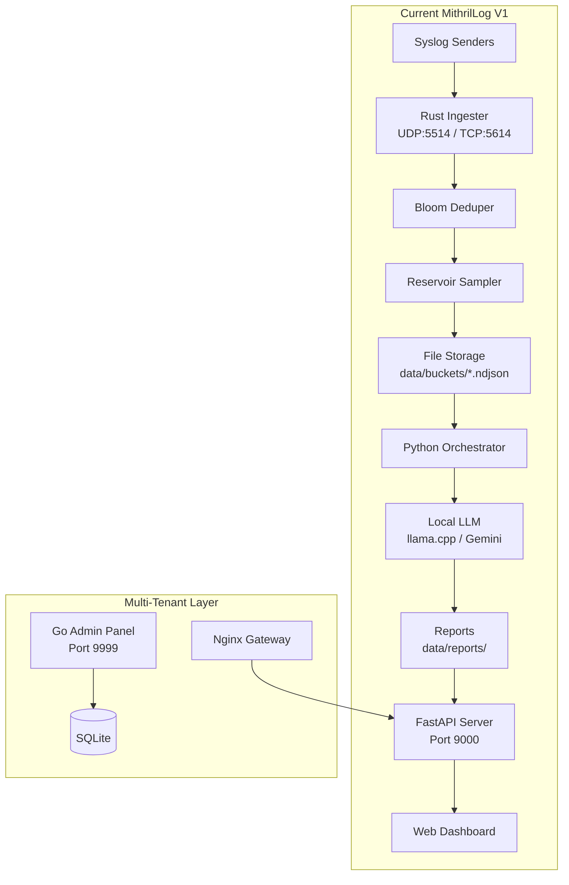
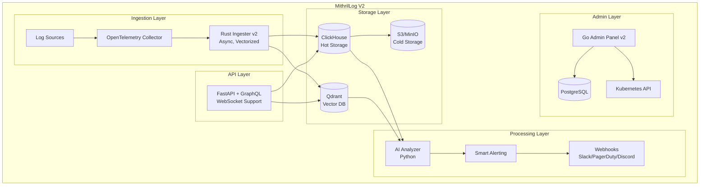

# MithrilLog V2 Upgrade Proposal

## Executive Summary

This proposal outlines a comprehensive upgrade path from MithrilLog V1 to V2, transforming the platform from a per-tenant Docker-based log analysis tool into a **unified, cloud-native, AI-powered observability platform**. The upgrade focuses on **scalability**, **real-time capabilities**, and **enterprise-grade features**.

---

## Current State Analysis

### Architecture Overview (V1)



### Current Stack Components

| Component | Technology | Status | 
|-----------|------------|--------|
| **Ingestion** | Rust (`ingester-rs`) | ✅ Production-ready |
| **Orchestrator** | Python | ✅ Working |
| **Summarization** | Gemini / llama.cpp | ✅ Working |
| **API Server** | FastAPI | ✅ Working |
| **Admin Panel** | Go (Gin) | ✅ Implemented |
| **Gateway** | Nginx + FastAPI | ✅ Working |
| **Database** | SQLite (`admin.db`) | ⚠️ Limiting scale |
| **Storage** | NDJSON files | ⚠️ No search capability |

### Identified Limitations

1. **Storage**: NDJSON files limit search speed and analytics
2. **Database**: SQLite doesn't scale for concurrent admin operations
3. **Isolation**: Per-tenant containers are resource-intensive
4. **Real-time**: No WebSocket support for live tail
5. **Search**: Linear scans of log files (slow for large datasets)
6. **Alerting**: Limited to Telegram only
7. **Security**: No API key authentication for ingestion

---

## V2 Target Architecture



---

## Proposed Changes by Phase

---

### Phase 1: Storage Modernization (Foundation)

> **IMPORTANT**: This phase is the foundation for all subsequent improvements. ClickHouse enables fast queries and PostgreSQL enables concurrent admin operations.

#### [NEW] ClickHouse Integration

**Purpose**: Replace NDJSON files with ClickHouse for hot storage

**Benefits**:
- 100x faster queries on time-series data
- Built-in compression (10:1 ratio)
- SQL interface for analytics
- Scales to billions of rows

**Schema**:
```sql
CREATE TABLE logs (
    timestamp DateTime64(3),
    tenant_id LowCardinality(String),
    severity LowCardinality(String),
    host String,
    app String,
    message String,
    pattern_hash String,
    INDEX idx_pattern pattern_hash TYPE bloom_filter GRANULARITY 1
) ENGINE = MergeTree()
PARTITION BY toYYYYMMDD(timestamp)
ORDER BY (tenant_id, timestamp)
TTL timestamp + INTERVAL 30 DAY;
```

**Files to Modify**:
- `src/ingester-rs/src/main.rs` - Add ClickHouse writer
- `src/mithrillog/orchestrator.py` - Read from ClickHouse
- `app/main.py` - Query ClickHouse for logs

---

#### [MODIFY] PostgreSQL for Admin Database

**Purpose**: Replace SQLite with PostgreSQL for admin panel

**Benefits**:
- Concurrent connections
- Complex billing queries
- Data integrity for financial records
- Prepared for multi-region deployment

**Files to Modify**:
- `admin-go/db/sqlite.go` → Rename to `postgres.go`
- `admin-go/docker-compose.yml` - Add PostgreSQL service

---

### Phase 2: Real-Time Capabilities

#### [NEW] WebSocket Live Tail

**Purpose**: Replace SSE polling with WebSocket for real-time log streaming

**Benefits**:
- Bi-directional communication
- Lower latency and connection overhead
- Scales to thousands of simultaneous viewers

**Implementation**:
```python
# app/main.py - New WebSocket endpoint
@app.websocket("/ws/logs/{tenant_id}")
async def websocket_logs(websocket: WebSocket, tenant_id: str):
    await websocket.accept()
    async for log in subscribe_to_logs(tenant_id):
        await websocket.send_json(log)
```

---

#### [NEW] Generic Webhook Alerting

**Purpose**: Extend alerting beyond Telegram to any webhook destination

**New File**: `src/mithrillog/alerting_v2.py`

**Supported Destinations**:
- Slack
- Discord
- PagerDuty
- Microsoft Teams
- Custom HTTP endpoints

**Configuration** (add to `default.yaml`):
```yaml
alert:
  enabled: true
  webhooks:
    - name: slack-ops
      url: https://hooks.slack.com/services/xxx
      events: [error, critical]
    - name: pagerduty
      url: https://events.pagerduty.com/v2/enqueue
      events: [critical]
```

---

### Phase 3: Semantic Search & AI Enhancements

#### [NEW] Vector Database Integration (Qdrant)

**Purpose**: Enable semantic log search with natural language queries

**Benefits**:
- Find similar errors without exact keywords
- "Show me all database timeout errors" → Works without exact match
- Anomaly detection using embeddings

**Flow**:
```
Log → Embedding Model (Gemini) → Qdrant Vector DB
                                      ↓
User Query → Embedding → Similarity Search → Results
```

---

#### [NEW] Root Cause Analysis Agent

**Purpose**: Automatic incident analysis using RAG (Retrieval-Augmented Generation)

**Workflow**:
1. Incident detected (error spike)
2. Agent fetches last 1 hour of logs from ClickHouse
3. Correlates with recent deployments (GitHub API)
4. Checks runbooks stored in vector DB
5. Suggests fix with confidence score

**Example Output**:
```
🔍 Root Cause Analysis
━━━━━━━━━━━━━━━━━━━━━━
Incident: 500 errors on /api/checkout
Timeframe: 21:15-21:30 UTC
Affected Users: 342

Root Cause:
└─ Database connection pool exhausted
   └─ Caused by: Deployment v2.3.4 (21:14 UTC)

Suggested Action: Rollback to v2.3.3
```

---

### Phase 4: Enterprise Features

#### [NEW] API Key Authentication for Ingestion

**Purpose**: Secure log ingestion with tenant-specific API keys

**Implementation**:
- API keys stored in PostgreSQL (hashed)
- Ingester validates `x-api-key` header or syslog metadata
- Keys can be rotated/revoked via admin panel

---

#### [NEW] Role-Based Access Control (RBAC)

**Roles**:
| Role | Permissions |
|------|-------------|
| **Viewer** | Read logs, view dashboards |
| **Editor** | Viewer + create alerts, modify retention |
| **Admin** | Editor + manage users, billing, API keys |

---

#### [NEW] Audit Logs

**Purpose**: Track all admin actions for compliance (SOC2/GDPR)

**Fields**: `timestamp`, `user_id`, `action`, `resource`, `details`, `ip_address`

---

### Phase 5: Performance & Scale

#### [NEW] Distributed Bloom Filter (Redis)

**Purpose**: Share deduplication state across ingester replicas

**Technology**: Redis with RedisBloom module

---

#### [NEW] Kubernetes Deployment

**Purpose**: Auto-scaling and zero-downtime deployments

**Components**:
- Helm charts for all services
- HPA for ingester scaling
- KEDA for event-driven scaling

---

## Migration Strategy

### Timeline

| Phase | Duration | Target |
|-------|----------|--------|
| Phase 1: Foundation | 1 month | 2025-01 |
| Phase 2: Real-Time | 2 weeks | 2025-02 |
| Phase 3: AI | 2 months | 2025-03 |
| Phase 4: Enterprise | 1 month | 2025-04 |
| Phase 5: Scale | 1 month | 2025-05 |

---

## Investment Summary

| Phase | Duration | Estimated Cost |
|-------|----------|----------------|
| Phase 1: Foundation | 1 month | $5k (infra) |
| Phase 2: Real-Time | 2 weeks | $2k |
| Phase 3: AI | 2 months | $15k (AI/ML tooling) |
| Phase 4: Enterprise | 1 month | $5k |
| Phase 5: Scale | 1 month | $10k |
| **Total** | **5-6 months** | **~$37k** |

---

## Breaking Changes in V2

1. SQLite → PostgreSQL migration requires data export/import
2. NDJSON files will be migrated to ClickHouse (one-time job)
3. New dependencies: ClickHouse, PostgreSQL, Redis, Qdrant

---

## Decision Points

1. Which phases should be prioritized first?
2. Should we keep backward compatibility with NDJSON files?
3. Which alerting integrations are most important (Slack/Discord/PagerDuty)?
4. Is Kubernetes migration required, or is Docker Compose sufficient for now?

---

## Verification Plan

### Automated Tests
- Unit tests for ClickHouse integration
- Integration tests for WebSocket endpoints
- Load testing with 100k logs/second

### Manual Verification
- Query performance benchmarks (NDJSON vs ClickHouse)
- WebSocket latency measurements
- Semantic search accuracy testing

---

*Document Version: 1.0*  
*Date: 2025-12-06*  
*Status: Approved*
