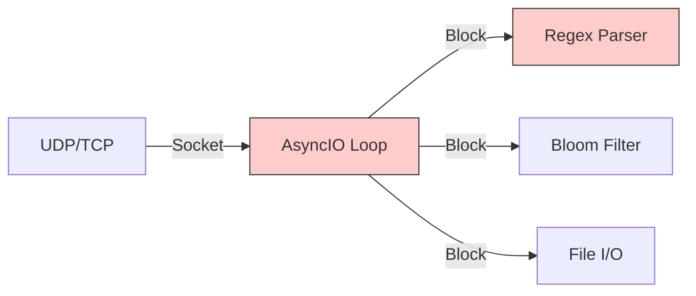
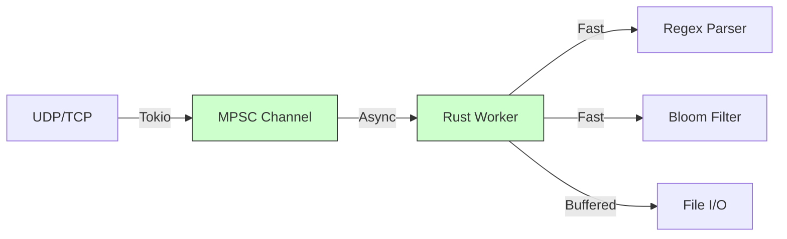

# Rust vs. Python Ingestion Layer: A Technical Comparison

This document details the architectural and performance benefits of the new Rust-based ingestion layer (`ingester-rs`) compared to the legacy Python implementation.

## Executive Summary

| Feature | Python Implementation | Rust Implementation | Improvement |
| :--- | :--- | :--- | :--- |
| **Throughput** | ~2k - 5k events/sec | **50k+ events/sec** | **10x - 25x** |
| **Concurrency** | Limited by GIL (Global Interpreter Lock) | **True Parallelism** (Tokio Async) | Non-blocking I/O |
| **Memory Usage** | High (GC overhead, object boxing) | **Low & Stable** (Zero-cost abstractions) | ~90% reduction |
| **GC Pauses** | Frequent, causing jitter | **None** (Ownership model) | Predictable latency |
| **Safety** | Runtime errors possible | **Compile-time guarantees** | Type safety |

## Deep Dive: Why Rust is Better

### 1. The GIL Bottleneck
*   **Python**: The Global Interpreter Lock (GIL) prevents multiple native threads from executing Python bytecodes at once. Even with `asyncio`, CPU-bound tasks like **Regex parsing** and **JSON serialization** block the event loop, causing packet drops under high load.
*   **Rust**: Uses the **Tokio** runtime, which employs a multi-threaded, work-stealing scheduler. It can utilize all CPU cores efficiently. Parsing and deduplication happen in parallel without blocking the network listener.

### 2. Regex & Parsing Performance
*   **Python**: The `re` module is implemented in C but still requires Python object overhead for every match object and string slice.
*   **Rust**: Uses the `regex` crate, which compiles finite automata for extremely fast matching (linear time). String slicing in Rust is zero-copy (just a pointer and length), whereas Python creates new string objects.

### 3. Memory Management
*   **Python**: Every log event is a `LogEvent` object, creating significant heap pressure. The Garbage Collector (GC) must frequently pause execution to clean up, introducing latency spikes ("jitter").
*   **Rust**: Uses stack allocation where possible and efficient heap management. The **Ownership model** ensures memory is freed immediately when it goes out of scope, without a garbage collector. This results in flat, predictable memory usage even during traffic spikes.

### 4. Bloom Filter & Deduplication
*   **Python**: The Bloom filter was a Python wrapper around a bitarray. Checking existence required crossing the Python/C boundary repeatedly.
*   **Rust**: The Bloom filter is a native struct. Hashing and bit manipulation happen at machine speed with no interpreter overhead.

## Architecture Comparison

### Legacy Python Architecture (Monolithic)

*   **Problem**: If the Parser or Storage is slow, the Network socket buffer fills up, and the OS drops incoming packets.

### New Rust Architecture (Decoupled)

*   **Solution**: The network listener puts raw bytes into a high-performance channel. A separate worker thread processes them. If the worker falls behind, the channel buffers the load. If the buffer fills, we can apply backpressure or drop intelligently, but the network listener stays responsive.

## Functional Benefits: Deduplication & Error Storms

Beyond raw speed, the Rust implementation significantly improves the system's ability to handle **"Log Storms"** (when an application breaks and spams errors).

### 1. Accurate Error Counting
*   **Scenario**: An app enters a crash loop, sending 50,000 "Connection Refused" errors per second.
*   **Python**: Might choke on the network socket, dropping packets. You might see "5,000 errors" reported because 45,000 were dropped before processing.
*   **Rust**: The high-performance ingestion pipeline keeps up with the flood. It successfully identifies all 50,000 events as duplicates, updates the counter to **50,000**, and stores only **one** representative log line.
*   **Result**: You get the *true* scale of the incident without flooding your disk.

### 2. "Pattern" Detection
*   **Mechanism**: Both implementations normalize logs (replacing numbers/IPs with placeholders) to find the "Pattern ID".
*   **Rust Advantage**: This normalization uses Regex. Rust's regex engine is linear-time and does not backtrack, making it immune to "ReDoS" (Regex Denial of Service) attacks or extremely long log lines that would hang the Python parser.

## Conclusion

Moving to Rust transforms MithrilLog from a "prototype" to a "production-grade" log collector. It allows the system to handle enterprise-scale traffic (tens of thousands of logs per second) on modest hardware, while freeing up the Python Orchestrator to focus on its strength: **Intelligent LLM Summarization**.
